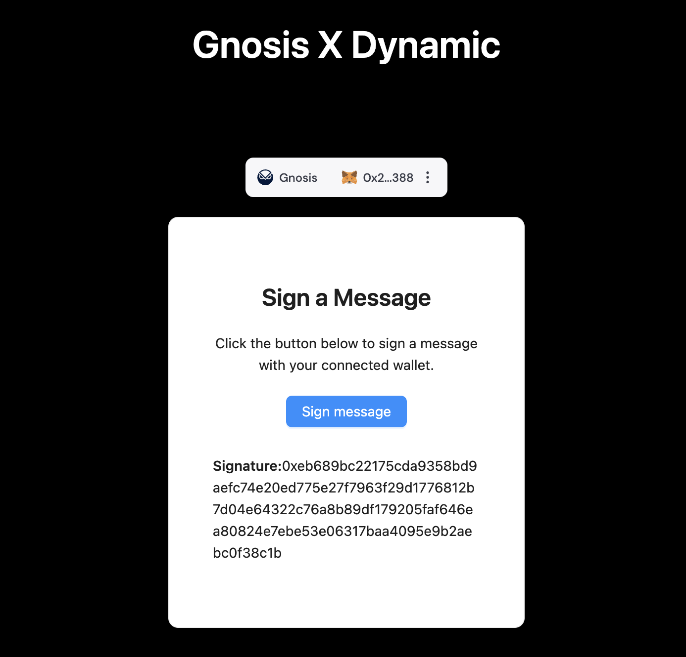

# Dynamic

Dynamic offers smart and beautiful login flows for crypto-native users, simple onboarding flows for everyone else, and powerful developer tools that go beyond authentication. This is a basic guide which demonstrates the integration of Dynamic wallet with Gnosis chain and generate offchain user signatures.




## Guide

- Create a NextJs application from scratch

```
npx create-next-app dynamic-gnosis
# install with Tailwind
```
- Install Dynamic labs SDK & some other dependencies

```
npm install @dynamic-labs/ethereum @dynamic-labs/ethers-v6 @dynamic-labs/sdk-react-core
```

- Create an account at [Dynamic Web App](https://app.dynamic.xyz/) and choose the Ethereum Sandbox option.
In the dashboard, enable the networks you want to allow your users. For our example we will enable Gnosis network. Also make sure you have Email as an authentication enabled for your users. This helps create a wallet by just using user's email.

- In the [developers section](https://app.dynamic.xyz/dashboard/developer/api), copy the Environment ID, we will need this in the next step.

- Initialize the SDK in your **layout.tsx** file like this. The goal is to initialize the SDK as early as possible when loading you application. Put your Environment ID in the proper variable.
Make sure you have **EthersExtension** also added in the extensions variable, this will be useful later!
```
export default function RootLayout({
  children,
}: {
  children: React.ReactNode;
}) {
  return (
    <html lang="en">
      <DynamicContextProvider
        settings={{
          environmentId: "<Replace with you own Environment ID>",
          walletConnectors: [EthereumWalletConnectors],
          walletConnectorExtensions: [EthersExtension],
        }}
      >
        <body className={inter.className}>{children}</body>
      </DynamicContextProvider>
    </html>
  );
}

```


- Create a components folder and inside that create a component **DynamicWidgetButton.tsx** and here we need to declare our DynamicWidget component provided to us by Dynamic SDK.

```
export const DynamicWidgetButton: React.FC = () => {
  return (
    <div style={{ display: 'flex', flexDirection: 'column', alignItems: 'center', marginBottom: '20px' }}>
      <Title level={3} style={{ marginBottom: '20px' }}>Wallet Interaction</Title>
      <div style={{ display: 'flex', justifyContent: 'center', alignItems: 'center' }}>
        <DynamicWidget />
      </div>
    </div>
  );
};

```

- Now we can use and initialize the Dynamic wallet anywhere in our app by just using the above component!

- Let's create our Main component in **page.tsx** file.

In this file, we will [**useDynamicContext**](https://docs.dynamic.xyz/sdks/react-sdk/hooks/usedynamiccontext#header) provided by the dynamic sdk to fetch the wallet connected. We will also use this same wallet to execute all our ethers expression.

```
  const { primaryWallet } = useDynamicContext();
```

- In our application, we have built a basic **Signer** component which uses the connected Dynamic wallet to generate a signature from the user.


```
  const signMessage = async () => {
    if (!primaryWallet) {
      console.error("No primary wallet connected");
      return;
    }

    try {
      const signedMessage = await primaryWallet.connector.signMessage('You are signing an example message');
      if (signedMessage) {
        setSignature(signedMessage);
      } else {
        setSignature(null);
      }
    } catch (error) {
      console.error("Error signing message:", error);
      setSignature(null);
    }
  };
```

You can also see that the **signMessage** function is provided by the  Dynamic SDK.  So cool!

## Using ethers

The last piece of component, I want to discuss is the **getBalance** component. Although Dybamic also gives a component to fetch user balance, this function is created to demonstrate how you can use standard ethers expression to build out your app further.

```
  const getBalance = async () => {
    if (!primaryWallet) {
      console.error("No primary wallet connected");
      return null;
    }

    const provider = await primaryWallet.connector?.ethers?.getRpcProvider();
    
    if (!provider) {
      console.error("No provider available");
      return null;
    }
    try {
      const balance = await provider.getBalance(primaryWallet.address);
      console.log(balance);
      return balance;
    } catch (error) {
      console.error("Error getting balance:", error);
      return null;
    }
  };

```

## Demo Application

You can check out this [**repository**](https://github.com/gnosischain/developer-resources/tree/main/custom-signers/dynamic-gnosis) for the full stack application demo.

